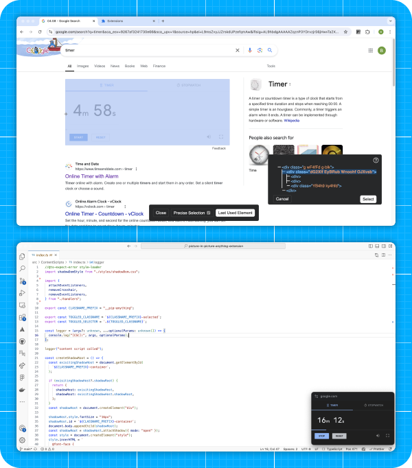

# Picture-in-Picture Anything

## Place Any Element on Top of your screen

---

A cross-browser (Chrome and Firefox) extension that allows you to put any element on the page into a native Picture-in-Picture window utilizing [Document Picture-in-Picture API](https://developer.mozilla.org/en-US/docs/Web/API/Document_Picture-in-Picture_API)

Some use cases:

- Video with controls and captions native to the website
- Music or Podcast player that is always on top of your screen.
- Timer or any other tool that you want to keep an eye on.
- Pop up the documentation into the PiP window and continue reading it while writing code.

## Usage instructions

Press a keyboard shortcut (Ctrl-Shift-P on Chrome, Alt-Shift-P on Firefox)
or
Click on the extension icon in the toolbar
or
Right-click on the page and select "Picture-in-Picture Anything" to open the Element Selection Overlay

Click the left mouse button to select an element.
Holding the Shift button will open a Precise Selection Panel. There, you can navigate the element tree and select precisely the element you want.
Pressing ESC before selecting an element will close the window.

## Browser support

Chrome / Chromium and Firefox 151 or newer. Firefox 151 is the minimum, because that is the version where the Document Picture-in-Picture API shipped.

The extension is built from a single codebase using [webextension-polyfill](https://github.com/mozilla/webextension-polyfill), and the manifest and bundle are generated per browser, so each build (`dist/chrome` and `dist/firefox`) only contains what that browser supports.

## Prerequisites

- Node.js 22.15 or newer
- pnpm (the version is pinned via the `packageManager` field — run `corepack enable` to let Node manage it, or install pnpm manually)
- Firefox 151 or newer, to run or test the Firefox build

## Building

1. Clone this repository
2. `pnpm install`
3. `pnpm run build` to build both browsers, or `pnpm run build:chrome` / `pnpm run build:firefox` for a single one.

The output is placed in `dist/chrome` and `dist/firefox`.

## Manual installation

### Chrome

1. `pnpm run build:chrome`
2. On the Extensions settings page, click the "Developer Mode" checkbox.
3. Click the "Load unpacked extension..." button.
4. Select the `dist/chrome` folder in the project directory.

### Firefox

1. `pnpm run build:firefox`
2. Open `about:debugging#/runtime/this-firefox`.
3. Click the "Load Temporary Add-on..." button and select `dist/firefox/manifest.json`.

## Development

`pnpm run dev` develops the Chrome build with hot reload — then load `dist/chrome` as an unpacked extension.
`pnpm run dev:firefox` develops the Firefox build — it launches Firefox 151+ with the extension loaded and reloads on change.

Other scripts:

- `pnpm run check:types` / `pnpm run check:types-classic` type-check with tsgo / tsc.
- `pnpm run firefox:lint` validates the Firefox build against the AMO rules.
- `pnpm run package:firefox` / `pnpm run package:chrome` produces a distributable zip.
