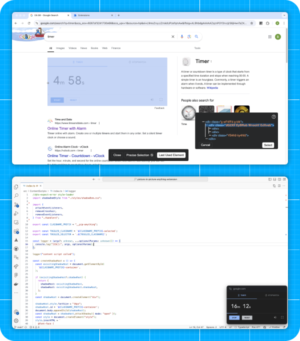

# Picture-in-Picture Anything
## Place Any Element on Top of your screen

***
A Chromium extension that allows you to put any element on the page into a native Picture-in-Picture window utilizing [Document Picture-in-Picture API](https://developer.mozilla.org/en-US/docs/Web/API/Document_Picture-in-Picture_API)

Some use cases:
- Video with controls and captions native to the website
- Music or Podcast player that is always on top of your screen.
- Timer or any other tool that you want to keep an eye on.
- Pop up the documentation into the PiP window and continue reading it while writing code.

## Usage instructions
Press a keyboard shortcut (Ctrl-Shift-P) 
or 
Click on the extension icon in the toolbar 
or 
Right-click on the page and select "Picture-in-Picture Anything" to open the Element Selection Overlay 

Click the left mouse button to select an element. 
Holding the Shift button will open a Precise Selection Panel. There, you can navigate the element tree and select precisely the element you want. 
Pressing ESC before selecting an element will close the window.

## Manual installation
1.  Clone this repository
2. `npm install`
3. `npm run build`
4. On the Extensions settings page, click the "Developer Mode" checkbox.
5. Click the "Load unpacked extension..." button. 
6. Select the `dist` folder in the project directory.

